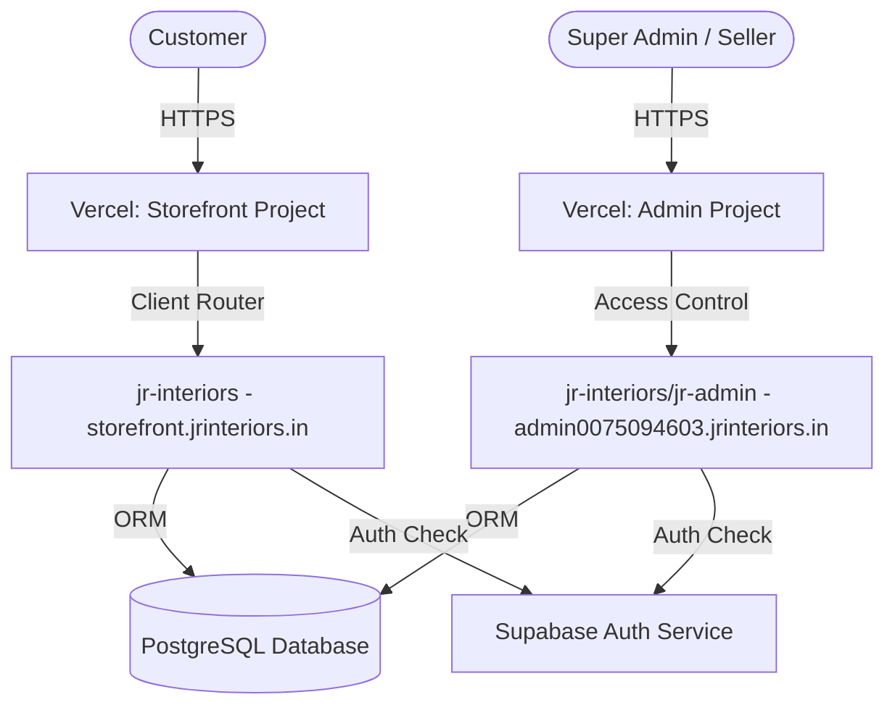

# Technical Architecture: JR Control

## 1. Monorepo Architecture

JR Control and the JR Interiors customer storefront exist in a unified monorepo. This guarantees shared schema definitions, synchronized data types, and consolidated deployment pipelines while enforcing a clean separation between public marketing systems and sensitive backend management systems.

### Workspace Structure

The monorepo uses NPM workspaces. The root [package.json](../package.json) maps these workspaces:

```
stitch_jr_interiors_website_blueprint-prject/
│
├── package.json                   # Monorepo configuration and scripts
├── package-lock.json              # Unified locks
│
├── jr-interiors/                  # PUBLIC STOREFRONT & SHARED CORE
│   ├── package.json               # Storefront dependencies
│   ├── prisma/                    # Schema, migrations, seeds (Database Single Source)
│   │   ├── schema.prisma
│   │   └── migrations/
│   ├── src/                       # Next.js App Router Source
│   │   ├── app/                   # Public storefront routes
│   │   ├── components/            # UI components (Shared primitives)
│   │   └── lib/                   # Base services, Supabase configuration, rate limiters
│   │
│   └── jr-admin/                  # ADMIN BUSINESS OPERATING SYSTEM (WORKSTAGE)
│       ├── package.json           # Admin dependencies (See package.json for versions)
│       ├── next.config.mjs        # Dedicated Webpack & rewrite configurations
│       ├── src/
│       │   ├── app/               # Admin routes (Dashboard, CRM, Catalog, etc.)
│       │   ├── components/        # Admin-specific components (Data tables, Forms)
│       │   └── lib/               # Custom security/auth libraries, logging
```

---

## 2. Core Technology Stack

The platform is standardized on a modern, type-safe stack. Exact package version declarations are maintained in [package.json](../package.json):

| Layer | Technology | Rationale |
| :--- | :--- | :--- |
| **Framework** | **Next.js** | React Server Components (RSC), App Router, server-side data fetching. |
| **Runtime** | **React** | Strict rendering, stable concurrent features. |
| **Language** | **TypeScript** | Strict compile-time safety across storefront and admin workspaces. |
| **Database** | **PostgreSQL** | Relational database ideal for transactional CRM, quotation engines, and inventory. |
| **ORM** | **Prisma** | Database client generation, migration tracking, type safety. |
| **Authentication** | **Supabase Auth** | JWT, secure session tokens, Multi-Factor Authentication (MFA/TOTP). |
| **Styling** | **Tailwind CSS & CSS**| Rapid, utility-first premium styling. |
| **Caching/Limit** | **Upstash Redis** | Serverless API protection and rate limiting. |

---

## 3. Database & Shared Types Integration

To prevent synchronization errors, the database client and schema reside solely in the storefront's Prisma folder.

*   **Prisma Client Generation**: Running `npm run prisma:generate` triggers client generation in both workspaces.
*   **Shared Types**: All database models (`Product`, `Lead`, `Order`, `AuditLog`) flow automatically from the generated client.
*   **Database Migrations**: Controlled from the storefront workspace directory (`npm run db:migrate`). No schema modifications are permitted outside of migrations.

---

## 4. Compile & Build Pipelines

Both applications compile independently but share the node module resolution context of the monorepo root.

### NPM Workspace Scripts

Configure operational scripts in the root `package.json` for orchestration:

*   `npm run dev:store`: Spawns the public Next.js development server on `localhost:3000`.
*   `npm run dev:admin`: Spawns the private admin Next.js development server on `localhost:3001`.
*   `npm run build:all`: Compiles both projects, verifying types and executing build-time checks.
*   `npm run prisma:generate`: Rebuilds type bindings for all workspaces.

---

## 5. Deployment and Hosting Strategy

JR Interiors is deployed on **Vercel** for high availability, CDN-level edge caching, and serverless compute scalability.



### Routing and Subdomains
1.  **Storefront**: Mapped to the root apex domain `jrinteriors.in` and `www.jrinteriors.in`.
2.  **Admin Console**: Mapped to the custom subdomain `admin0075094603.jrinteriors.in`. See [Security Architecture](./03_SECURITY.md) for details on access masking.

### Vercel Deployment Configuration
Each workspace has a dedicated Vercel project connected to the same GitHub repository:
*   **Storefront Build Config**:
    *   Root Directory: `jr-interiors`
    *   Build Command: `npm run build`
    *   Output Directory: `.next`
*   **Admin Build Config**:
    *   Root Directory: `jr-interiors`
    *   Build Command: `npm run build --workspace=jr-admin`
    *   Output Directory: `jr-admin/.next`
