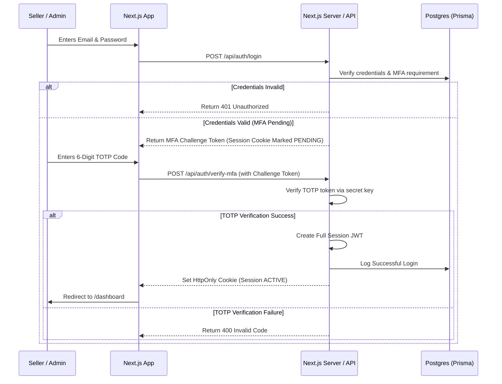

# Security Architecture: JR Control

## 1. Threat Model & Subdomain Masking

JR Control manages sensitive operational datasets: financial margins, client personal data, product drawings, and vendor details. To minimize the threat vector, we employ multiple defense layers:

### Subdomain Masking
The administration panel is deployed on the custom subdomain `admin0075094603.jrinteriors.in`.
> [!IMPORTANT]
> The obfuscated subdomain reduces casual discovery by automated crawlers but is **not** considered a security boundary. All security relies on robust authentication, granular authorization, input validation, and defense-in-depth security controls.

*   **Discovery Obfuscation**: There are no references to the admin path in the public storefront's sitemap, robotics instructions (`robots.txt`), or HTML headers.
*   **Edge Validation**: Incoming traffic requesting the subdomain must pass through Edge verification middleware. Unauthenticated requests are not shown a standard login form but rather redirect or display a generic error template unless requesting the exact login route.

---

## 2. Authentication Flow & MFA (2FA/TOTP)

Authentication is handled via **Supabase Auth** or a custom session token scheme, hardened with mandatory **Multi-Factor Authentication (MFA/TOTP)**.

### Password Hashing Standards
All local administrative user password hashes stored in the database must use **Argon2id** (the profile recommended by OWASP). 
*   **Configuration Targets**: Iterations = `3`, Memory = `65536 KB` (64 MB), Parallelism = `4`.
*   *Verification*: Handled strictly on the Server side before generating token cookies.

### MFA Enforcement Rules
1.  **Mandatory Onboarding**: New seller or administrator accounts are created by the Super Admin in a `PENDING_MFA` status. Upon first login, they are presented with a setup screen showing a secure QR code (generated via a TOTP secret) and must scan it using an authenticator app (Google Authenticator, Duo, etc.).
2.  **State Blocking**: Access to any admin route (except `/login` and `/onboarding`) is rejected by the server if the session's MFA validation state is not flagged as `VERIFIED`.

---

## 3. Session Management

Sessions are managed using server-signed, stateless JWT tokens transmitted via secure cookies.

*   **Cookie Attributes**:
    *   `HttpOnly`: Prevents client-side scripts (XSS attacks) from reading the session token.
    *   `Secure`: Ensures the cookie is only transmitted over HTTPS connections.
    *   `SameSite=Strict`: Blocks CSRF attacks by ensuring the cookie is not sent along with cross-site requests.
    *   `Path=/`: Scopes the cookie to the entire admin domain.
*   **Session Lifetime & Timeout**:
    *   **Absolute Expiry**: 12 hours. Users must log in again after 12 hours regardless of activity.
    *   **Inactivity Timeout**: 30 minutes. The frontend tracks user activity (clicks, keypresses). After 30 minutes of idle status, it triggers an API call to revoke the session and redirects the browser to the login screen.
*   **Session Revocation**:
    *   Active sessions are stored in an memory cache (Upstash Redis) or verified against a session version flag in the database.
    *   A Super Admin can instantly invalidate all active sessions for a specific user ID by updating the user's `sessionVersion` in the database, rendering existing JWT cookies invalid.

---

## 4. Role-Based Access Control (RBAC)

The application enforces a strict privilege matrix. Permissions are validated on the Edge (via Next.js Middleware) and re-verified inside all API routes and Server Actions.

For the complete list of module privileges and route protection middlewares, see [RBAC Matrix](./14_ROLES.md).
