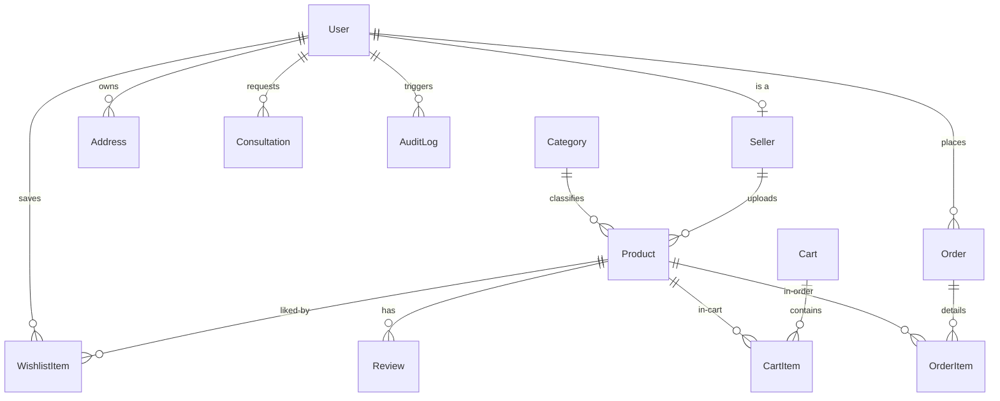

# Data Model: JR Control

## 1. Database Schema Overview

JR Control uses a relational **PostgreSQL** database managed via the **Prisma ORM**. The single source of truth for the database layout is located at the schema file `../prisma/schema.prisma`.

To prevent currency floating-point errors, all monetary amounts are stored as **integers in cents** (e.g., USD cents or INR paise, where ₹10.00 is stored as `1000`).

---

## 2. Entity Dictionary & Schema Documentation

### User Management & Auth
*   **User**: Represents any authenticated individual on the platform.
    *   `role`: Standard roles are `"CUSTOMER"`, `"SELLER"`, and `"ADMIN"` (which acts as the operator and maps to Super Admin privileges based on specific user records).
    *   `passwordHash`: Stored as a salted Argon2id hash. See [Security Architecture](./03_SECURITY.md).
*   **Seller**: Represents a luxury partner or internal sales representative.
    *   Linked 1:1 to `User` via `userId`.
    *   Contains profile assets: `brandName`, `slug`, `bio`, `logoUrl`, and `status` (`"active"` or `"suspended"`).

### Showroom Catalog
*   **Category**: Grouping for storefront filtering.
    *   `kind`: Categorized into `"room"` (Living, Office, etc.), `"collection"`, or `"type"` (Seating, Lighting, etc.).
*   **Product**: Individual design pieces.
    *   `priceCents`: Fixed integer representing baseline pricing.
    *   `status`: Moderation workflow state: `"DRAFT"`, `"PENDING"` (awaiting approval), `"PUBLISHED"` (live on storefront), or `"REJECTED"` (denied by admin).
    *   `reviewNote`: Stores the reason written by an administrator when rejecting a product upload.
    *   `finishes`: Stored as a JSON block representing available material swatches (e.g., `[{ "name": "Walnut", "hex": "#5c4033" }]`).

### Transactions & Leads
*   **Consultation**: Design request leads captured from contact forms.
    *   `status`: Leads transition through states: `"NEW"` ➔ `"CONTACTED"` ➔ `"SCHEDULED"` ➔ `"COMPLETED"`.
*   **Order**: Documented purchase transactions.
    *   `number`: Unique human-readable invoice or invoice tracking number.
    *   `status`: Transaction milestones: `"confirmed"`, `"processing"`, `"shipped"`, `"delivered"`, `"cancelled"`.
    *   `paymentStatus`: Razorpay or cash-on-delivery tracking state: `"pending"`, `"paid"`, `"failed"`.
*   **OrderItem**: Snapshot of product metadata at the instant of order creation.
    *   `priceCents`, `name`, `imageUrl`, `finish`, `upholstery`: Copied from the product model to preserve records against catalog updates or deletions.

---

## 3. Indexing & Query Optimization Strategy

Indices are explicitly defined to speed up search, sorting, and storefront rendering queries:

*   **Catalog Filtering**: Combined indexes on `[room, type]` and `[status, createdAt]` ensure immediate load times for storefront showroom pages without full-table scans.
*   **Search and Sort**: Indexes on `priceCents` (price asc/desc), `reviewCount` (popularity sorting), and `material` speed up grid page sorting operations.
*   **Security Auditing**: Log queries search against `[userId, createdAt]` and `[action]` to populate administrative audit dashboards quickly.
*   **User Lookups**: Unique constraint indexes on `User.email`, `Seller.slug`, `Order.number`, and `Category.slug` ensure fast primary lookups.

---

## 4. Audit Log Schema (`AuditLog`)

To maintain administrative trace integrity and comply with security rules, the `AuditLog` table stores append-only logs of critical state changes.

*   `userId`: Foreign key of the user initiating the action.
*   `action`: Standardized mutation namespaces:
    *   `AUTH_LOGIN_SUCCESS` / `AUTH_LOGIN_FAIL`
    *   `CATALOG_PRODUCT_CREATE` / `CATALOG_PRODUCT_EDIT` / `CATALOG_PRODUCT_PUBLISH`
    *   `ORDER_STATUS_UPDATE`
    *   `LEAD_STATUS_UPDATE`
    *   `USER_ROLE_CHANGE`
*   `entity`: Name of the modified database model (e.g., `"Product"`).
*   `entityId`: CUID value of the modified database row.
*   `details`: JSON-serialized string capturing a key-value diff of modified attributes (e.g., `{"priceCents": [12000, 15000]}`).
*   `ipAddress` & `userAgent`: Captured from Next.js server headers to locate requests.
